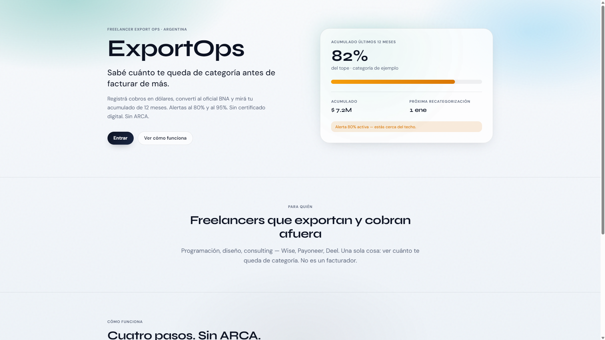
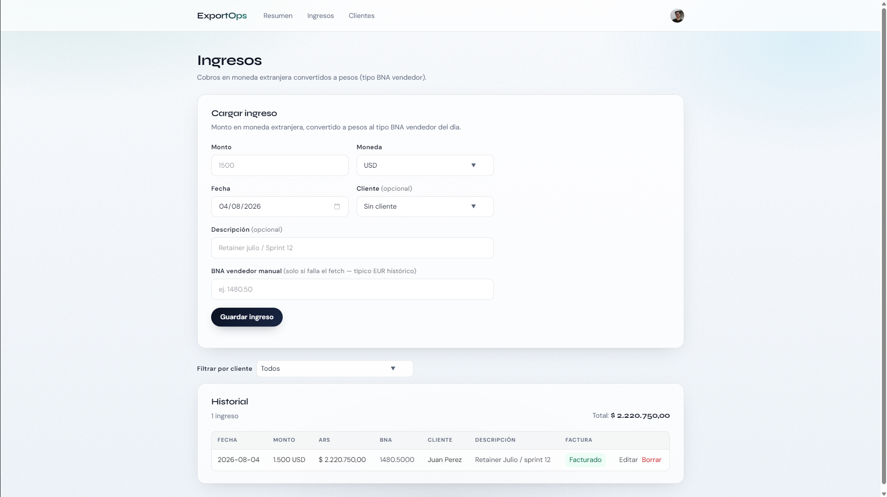
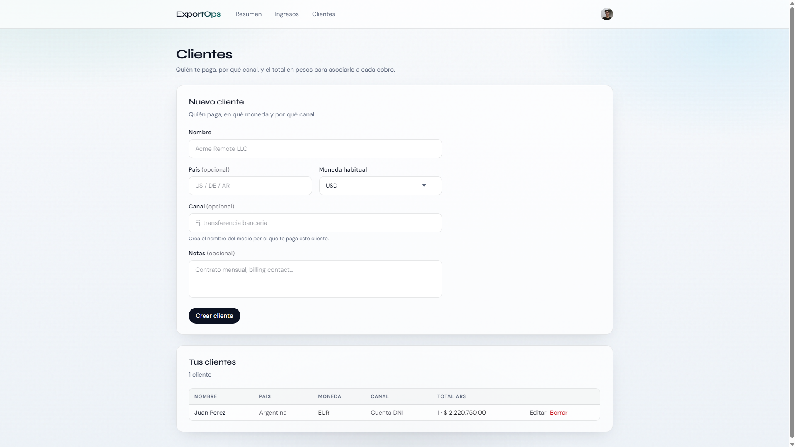

# ExportOps

**Freelancer Export Ops Cockpit (Argentina).**

> Sabé cuánto te queda de categoría antes de facturar de más.

Live: [https://export-ops-jade.vercel.app](https://export-ops-jade.vercel.app)

Registrá cobros en dólares, convertí al oficial BNA y mirá tu acumulado de 12 meses contra el tope de tu categoría — con alertas antes de la recategorización de enero/julio.

## Qué es

Cockpit mínimo para freelancers y contractors argentinos que exportan servicios y cobran afuera (Wise, Payoneer, Deel):

| Pieza | Qué hace |
| --- | --- |
| **Ledger** | Cobro USD/EUR + fecha → ARS al tipo vendedor BNA del día |
| **Runway** | Rolling 12 meses, % del tope, countdown a 1 ene / 1 jul |
| **Clientes** | Quién paga, moneda, canal |
| **Alertas** | In-app al 80% / 95% del tope + ventana de recategorización |

Una sola cosa: **runway fiscal visible**. No es un facturador.

## Qué NO es (anti-scope, v1)

- ❌ No emite Factura E ni CAE. Cero ARCA/webservices.
- ❌ No asesora liquidación de divisas (BCRA/PSP).
- ❌ No hace contabilidad ni DDJJ.
- ❌ No es app móvil nativa ni marketplace.
- ❌ No maneja datos clínicos ni portal multi-tenant para contadores.

> **Disclaimer:** No somos contadores ni reemplazamos ARCA. Los topes los cargás vos según la tabla vigente. Consultá siempre a tu contador.

## Stack

- [Next.js](https://nextjs.org) (App Router) + TypeScript + Tailwind CSS v4
- [Prisma](https://prisma.io) + PostgreSQL ([Neon](https://neon.tech))
- [Clerk](https://clerk.com) auth
- Deploy: [Vercel](https://vercel.com)
- FX: tipo vendedor BNA del día (helper local; sin PSP)

## Screenshots

Demo live con seed @ ~82% (banner 80% activo en el preview de la landing).

### Landing — `/`

Hero + preview del acumulado 12 meses + countdown de recategorización.



### Ledger — `/app/ingresos`

Alta de cobro USD/EUR, conversión BNA vendedor y historial con total ARS.



### Clientes — `/app/clientes`

Quién paga, moneda, canal y vínculo income ↔ client.



## Setup local

```bash
npm install
cp .env.example .env
# Completá DATABASE_URL (Neon) y las keys de Clerk (publishable + secret)
npx prisma migrate dev
npm run db:seed   # opcional — demo ~82% del tope
npm run dev
```

App en [http://localhost:3000](http://localhost:3000).

### Variables

Ver [`.env.example`](./.env.example). Mínimo:

- `DATABASE_URL` — Neon Postgres  
- `NEXT_PUBLIC_CLERK_PUBLISHABLE_KEY` / `CLERK_SECRET_KEY`  
- URLs de Clerk (`SIGN_IN` / `SIGN_UP` / after-auth → `/app`)

### Health check

Con la app arriba (o en prod):

```bash
curl https://export-ops-jade.vercel.app/api/health
# → {"ok":true,"db":"up","ts":"..."}
```

## Scripts útiles

| Script | Uso |
| --- | --- |
| `npm run dev` | Dev server |
| `npm run build` | `prisma generate` + Next build |
| `npm run db:seed` | Seed demo |
| `npx tsx scripts/qa-day7-alerts.ts` | QA helpers de alertas (Day 7) |

## Status

**MVP ship gate (Day 8 / week 4).** Scope congelado: no se amplía v1 hacia ARCA, facturación o marketplace. Señal = demo live + este README + post LinkedIn; sin tracción → freeze y vuelta a deepen de repos existentes.

## Licencia / contexto

Proyecto de portafolio (roadmap hire-first). Código personal; no es consejo fiscal ni producto comercial.
